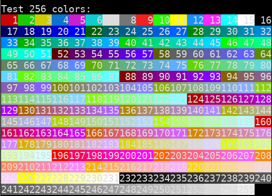

📑 [Color codes cheatsheet](https://delameter.github.io/termcolor) |
📦 [pypi/termcolor](http://pypi.python.org/pypi/termcolor)

## Example

```python
import sys
from termcolor import colored, cprint, COLOR_RED, ATTR_BOLD

text = colored('Hello, World!', termcolor.COLOR_RED)
print(text)
cprint('Hello, World!', 'green', 'on_red', attrs=['reverse', 'blink'])

print_red_on_cyan = lambda x: cprint(x, 'red', 'on_cyan')
print_red_on_cyan('Hello, World!')
print_red_on_cyan('Hello, Universe!')

for i in range(10):
    cprint(str(i), 'magenta', end=' ')

cprint("Attention!", 'red', attrs=termcolor.ATTR_BOLD, file=sys.stderr)
```


## Environment variables

**ANSI_COLORS_FORCE**
  if set to anything, even empty string, colors will be printed.

**ANSI_COLORS_DISABLED**
  if set to anything no colors will be printed, overrides **ANSI_COLORS_FORCE**.

If none of the environment variables is set the colors are used
only if the ``stdout`` is attached to a terminal: ``sys.stdout.isatty()``.


## Text properties

| Text colors   | Text highlights  | Attributes |
| ------------- | ---------------- | ---------- |
| black         | on_black         | bold       |
| grey          | on_grey          | dark       |
| red           | on_red           | underline  |
| green         | on_green         | blink      |
| yellow        | on_yellow        | reverse    |
| blue          | on_blue          | concealed  |
| magneta       | on_magneta       |            |
| cyan          | on_cyan          |            |
| light_grey    | on_light_grey    |            |
| dark_grey     | on_dark_grey     |            |
| light_red     | on_light_red     |            |
| light_green   | on_light_green   |            |
| light_yellow  | on_light_yellow  |            |
| light_blue    | on_light_blue    |            |
| light_magenta | on_light_magenta |            |
| light_cyan    | on_light_cyan    |            |
| white         | on_white         |            |


## Terminal properties

| Terminal         | bold   | dark | underline | blink   | reverse | concealed | 256 colors | 24-bit color |
| :--------------- | :----: | :--: | :-------: | :-----: | :-----: | :-------: | :--------: | :----------: |
| **linux**        |   ✔    |  ✔   |   bold    |    ✔    |    ✔    |     🚫    |     🚫     |      🚫      |
| **konsole**      |   ✔    |  ✔   |     ✔     |    ✔    |    ✔    |     ✔     |     ✔      |      ✔       |
| **terminator**   |   ✔    |  ✔   |     ✔     |    ✔    |    ✔    |     ✔     |     ✔      |      ✔       |
| **kitty**        |   ✔    |  ✔   |     ✔     |    ✔    |    ✔    |     ✔     |     ✔      |      ✔       |
| **xterm**        |   ✔    |  ✔   |     ✔     |    ✔    |    ✔    |     ✔     |     ✔      |      ✔       |
| **rxvt**         |   ✔    |  🚫  |     ✔     |    ✔    |    ✔    |     🚫    |     ✔      |      🚫      |
| **dtterm**       |   ✔    |  ✔   |     ✔     | reverse |    ✔    |     ✔     |     ⍰      |      ⍰       |
| **teraterm**     | reverse | 🚫  |     ✔     | rev/red |    ✔    |     🚫    |     ⍰      |      ⍰       |
| **aixterm**      | normal |  🚫  |     ✔     |    🚫   |    ✔    |     ✔     |     ⍰      |      ⍰       |
| **Windows**      |   🚫   |  🚫  |    🚫     |    🚫   |    ✔    |     🚫    |     🚫     |      ✔       |
| **PuTTY**        | ✔[^2]  |  🚫  |     ✔     |  ✔[^1]  |    ✔    |     🚫    |     ✔      |      ✔       |
| **Cygwin SSH**   |   ✔    |  🚫  |   color   |  color  |  color  |     ✔     |     ⍰      |      ⍰       |
| **Mac Terminal** |   ✔    |  🚫  |     ✔     |    ✔    |    ✔    |     ✔     |     ⍰      |      ⍰       |
| **iTerm2**       |   ✔    |  🚫  |     ✔     |    ✔    |    ✔    |     ✔     |     ⍰      |      ⍰       |

[^1]: Disabled by default
[^2]: Supports color change, bold text or both.

## Similar projects

You may want to check out 📦 [pypi/colorama](https://pypi.org/project/colorama/) for more advanced options.
