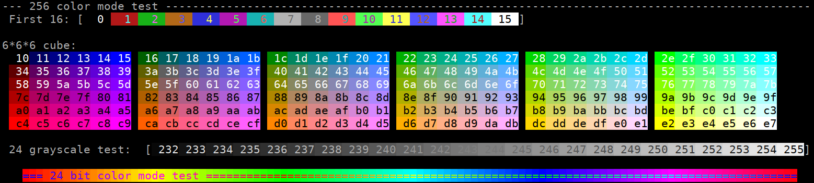
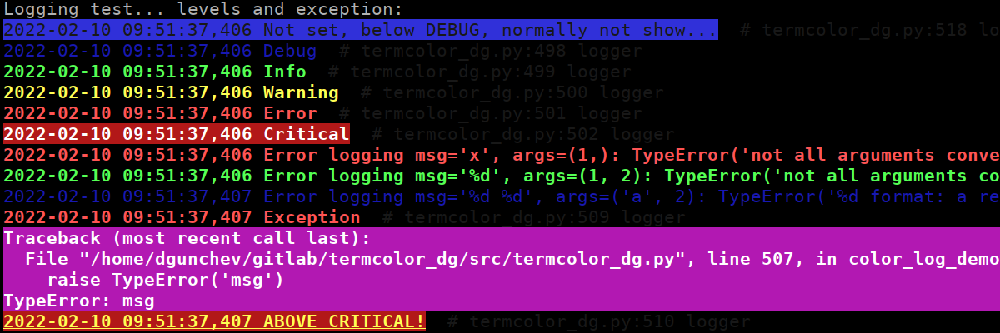

# Termcolor

📦 [pypi/termcolor2](https://pypi.python.org/pypi/termcolor2) |
📦 [pypi/termcolor](https://pypi.python.org/pypi/termcolor) |
📑 [Color codes cheatsheet](https://delameter.github.io/termcolor) |
📑 [ANSI/VT100 Terminal Control Escape Sequences](https://www2.ccs.neu.edu/research/gpc/VonaUtils/vona/terminal/vtansi.htm)

ANSII Color formatting for output in the terminal. Supports 16 color, 256 color and 24-bit color modes.

Python 2 support is present for legacy projects and because it is not too much work.


## Example

```python
>>> from termcolor2 import colored, cprint
>>>
>>> print(colored('Hello, World!', 'light_red', 'on_blue'))
>>> cprint('Hello, World!', 'blue', 'on_light_red', ['reverse', 'blink'])
>>>
>>> print_red_on_cyan = lambda x: cprint(x, 'red', 'on_cyan')
>>> print_red_on_cyan('Hello, World!')
>>>
>>> for i in range(10):
>>>     cprint(str(i), 'magenta', end=' ' if i != 9 else '\n')
>>>
>>> import sys
>>> cprint("Attention!", 'red', attrs=('bold'), file=sys.stderr)
>>>
>>> import logging
>>> from termcolor2 import logging_basic_color_config
>>> logging_basic_color_config()
>>> logging.log(logging.INFO, 'test')
```


## Colors demo screenshot (`python -m termcolor2`):




## Colored logs demo screenshot (`python -m termcolor2 logs`):




## Environment variables

**ANSI_COLORS_FORCE**
  if set to anything, even empty string, color escape sequences will be added.

**ANSI_COLORS_DISABLED**
  if set to anything no coloring will be performed, overrides **ANSI_COLORS_FORCE**.

If none of the environment variables is set the colors are used
only if the ``stdout`` is attached to a terminal: ``sys.stdout.isatty()``.


## Text properties

| Text colors   | Text highlights | Alt Text highlights  | Attributes |
| ------------- | --------------- | -------------------- | ---------- |
| black         | black           | on_black             | bold       |
| red           | red             | on_red               | dark       |
| green         | green           | on_green             | underline  |
| yellow        | yellow          | on_yellow            | blink      |
| blue          | blue            | on_blue              | reverse    |
| magenta       | magenta         | on_magenta           | concealed  |
| cyan          | cyan            | on_cyan              |            |
| light_grey    | light_grey      | on_light_grey        |            |
| dark_grey     | dark_grey       | on_dark_grey         |            |
| light_red     | light_red       | on_light_red         |            |
| light_green   | light_green     | on_light_green       |            |
| light_yellow  | light_yellow    | on_light_yellow      |            |
| light_blue    | light_blue      | on_light_blue        |            |
| light_magenta | light_magenta   | on_light_magenta     |            |
| light_cyan    | light_cyan      | on_light_cyan        |            |
| white         | white           | on_white             |            |


## Terminal properties support


| Terminal         |  bold  | dark | underline |  blink  | reverse | concealed | 256 colors | 24-bit color |
| :--------------- | :----: | :--: | :-------: | :-----: | :-----: | :-------: | :--------: | :----------: |
| **linux**        | ❎[^3] |❎[^3]|   ✅[^3]  |  ✅[^3] |    ✅   |     ❎    |     ❎     |      ❎      |
| **konsole**      |   ✅   |  ✅  |     ✅    |    ✅   |    ✅   |     ✅    |     ✅     |      ✅      |
| **terminator**   |   ✅   |  ✅  |     ✅    |    ✅   |    ✅   |     ✅    |     ✅     |      ✅      |
| **kitty**        |   ✅   |  ✅  |     ✅    |    ✅   |    ✅   |     ❎    |     ✅     |      ✅      |
| **xterm**        |   ✅   |  ❎  |     ✅    |    ✅   |    ✅   |     ✅    |     ✅     |      ✅      |
| **rxvt**         |   ✅   |  ❎  |     ✅    |    ✅   |    ✅   |     ❎    |     ✅     |      ❎      |
| **dtterm**       |   ✅   |  ✅  |     ✅    | reverse |    ✅   |     ✅    |     ❓     |      ❓      |
| **teraterm**     | reverse|  ❎  |     ✅    | rev/red |    ✅   |     ❎    |     ❓     |      ❓      |
| **aixterm**      | normal |  ❎  |     ✅    |    ❎   |    ✅   |     ✅    |     ❓     |      ❓      |
| **Windows**      |   ❎   |  ❎  |     ❎    |    ❎   |    ✅   |   ✅[^4]  |     ❓     |      ✅      |
| **PuTTY**        | ✅[^2] |  ✅  |     ✅    |  ✅[^1] |    ✅   |     ❎    |     ✅     |      ✅      |
| **Cygwin SSH**   |   ✅   |  ❎  |    color  |  color  |  color  |     ✅    |     ❓     |      ❓      |
| **Mac Terminal** |   ✅   |  ❓  |     ✅    |    ✅   |    ✅   |     ✅    |     ✅     |      ✅      |
| **iTerm2**       |   ✅   |  ❓  |     ✅    |    ✅   |    ✅   |     ✅    |     ✅     |      ✅      |

[^1]: Disabled by default
[^2]: Supports color change, bold text or both.
[^3]: See [VGA text mode](https://en.wikipedia.org/wiki/VGA_text_mode)
[^4]: See [Add support for the "concealed" graphic rendition attribute #6876 ](https://github.com/microsoft/terminal/issues/6876)


## Similar projects

You may want to check out:

- 📦 [pypi/termcolor](https://pypi.python.org/pypi/termcolor) - the original project termcolor2 extends
- 📦 [pypi/colorama](https://pypi.org/project/colorama/) for more advanced options.


## Interesting links

- [Terminal Colors](https://github.com/termstandard/colors) discussion with examples
